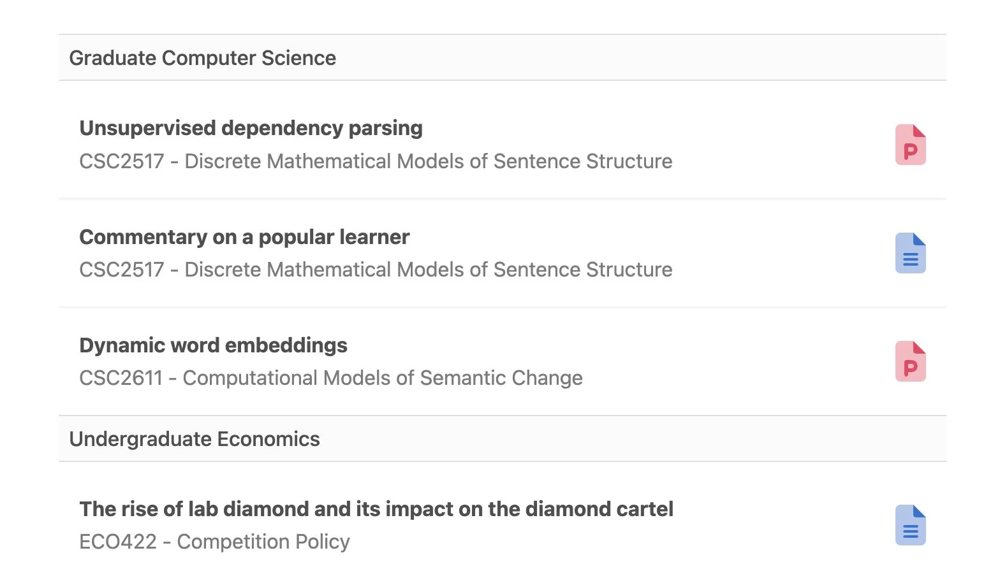
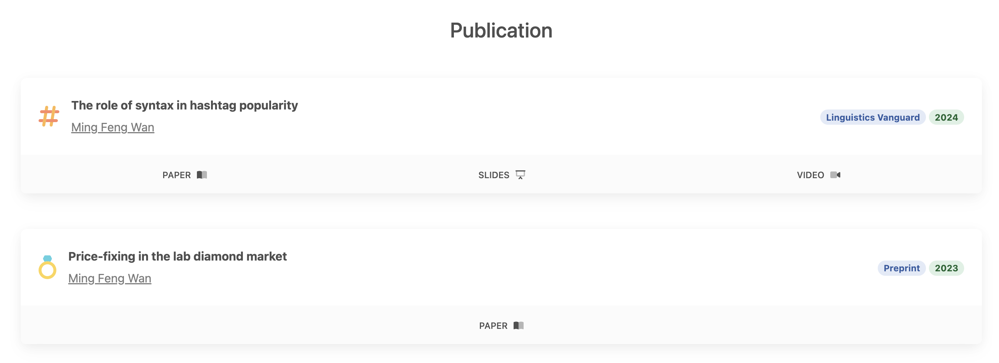
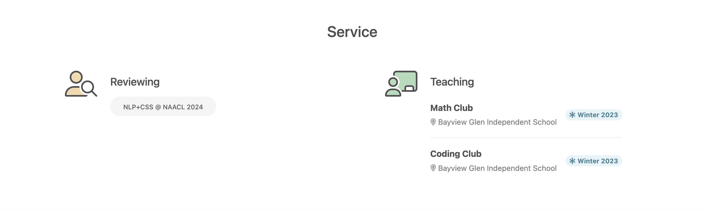
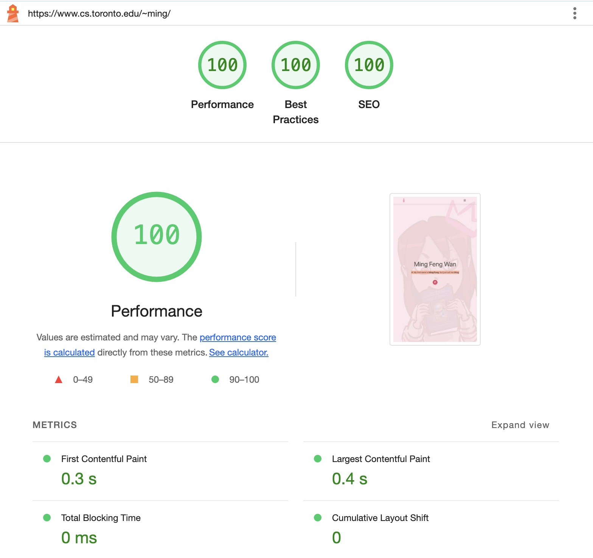

<div align="center">

<h1>MDB 5 Academic Portfolio Template</h1>
<h3><a target="_blank" href="https://www.cs.toronto.edu/~ming/">Academic website demo</a></h3>

Built with [Material Design for Bootstrap 5](https://github.com/mdbootstrap/mdb-ui-kit/)
(💗 by [its creators](https://www.facebook.com/share/p/zwKH5b8mkEDddha3/))
and [Font Awesome 6 Pro](https://fontawesome.com/).

[](https://www.cs.toronto.edu/~ming/)
</div>

## Features

Brand-new designs for **Coursework**, **Publication**, and **Academic Service** sections.

|  | 
|:-------------------------------------------------------------------------:| 
|                          **Coursework** Section                           |

|  | 
|:-------------------------------------------------------------------------:| 
|                          **Publication** Section                          |

|  | 
|:-----------------------------------------------------------------:| 
|                        **Service** Section                        |

<br>

### Photo gallery

To enhance loading times, all large photos are shown on a photo slider page featuring an animated blooming flower 
background. [See live example](https://www.cs.toronto.edu/~ming/photos.html).

|  | 
|:--------------------------------------------------------:| 
|           Screenshot of the Photo Slider Page            |

<br>

### Optimized performance

This template underwent thorough tree shaking and achieved an impressive speed score, even with the inclusion of
[a large-sized WebP file](https://www.cs.toronto.edu/~ming/pics/drawing.webp).

|                   |
|:-----------------------------------------------------------------------------:|
| [Google Lighthouse](https://developer.chrome.com/docs/lighthouse/) Screenshot |

<br>

___

## Usage

If no customization is required, *just* download [index.html](dist/index.html), [main.css](dist/main.css) and [main.js](dist/main.js) from the
[distribution](/dist) folder, then modify the content in [index.html](dist/index.html). Ensure both files are placed in
the same folder. Webpack is only necessary for additional customization. For the photo slider, download
[photos.html](/dist/photos.html), [photos.css](/dist/photos.css), and [photos.js](/dist/photos.js).

### Color Scheme

Please follow the color scheme for [MDBootstrap](https://mdbootstrap.com/docs/standard/content-styles/colors/) when
changing or adding colors.

## Webpack

### Installation

```
npm install
```

A free version of **MDB UI Kit** and a paid version of **Font Awesome** are already included as a dependencies, in
[package.json](package.json).
Upgrade to paid or downgrade to free as you like.

### Dev Server

```
npm run start
```

### Build

```
npm run build
```

### Features:

* Bundling via [Webpack](https://github.com/webpack/webpack) 5.98.0
* SASS Support via [sass-loader](https://github.com/webpack-contrib/sass-loader) v16.0.5
* Unit Testing via [jest](https://github.com/facebook/jest) v29.0.1

### Files structure:

```
mdbootstrap-academic/
├── dist/
│   └── index.html
├── src/
│   ├── js/
│   └── scss/
├── webpack.config.js
└── package.json
```

## MDB UI KIT

In this project, I imported `Collapse, Tooltip, Ripple, Carousel`. You can
remove [Tooltip](https://mdbootstrap.com/docs/standard/components/tooltips/) and
[Carousel](https://mdbootstrap.com/docs/standard/components/carousel/) if you are not using these UI components.

### Importing JS modules

You can import the entire library (not recommended):

```
import * as mdb from 'mdb-ui-kit'; // lib
```

or just individual modules:

```
import { Input } from 'mdb-ui-kit'; // module
import { Input as CustomInput } from 'mdb-ui-kit'; // module with custom name
```

### Importing CSS file

You can modify my imports in [main.scss](src/scss/main.scss), as recommended by
[MDB's guide](https://mdbootstrap.com/docs/standard/getting-started/optimization/).

Alternatively, you can import the entire MDB stylesheet:

```
@import '~mdb-ui-kit/css/mdb.min.css';
```