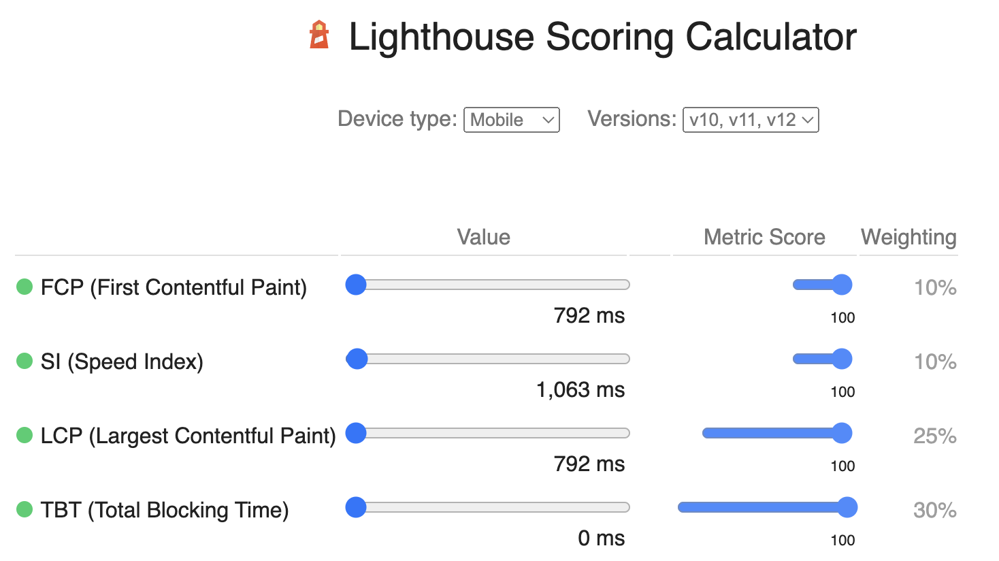

# MDB 5 Academic Portfolio Template

### Built with [Bootstrap 5 + Material Design 2.0 UI Kit](https://github.com/mdbootstrap/mdb-ui-kit/) and Font Awesome 6 Pro
### [>> My academic website built with this template](https://www.cs.toronto.edu/~ming/)

## Usage

If you don't need any customization, simply download [index.html](dist/index.html) and [main.js](dist/main.js) from
the [distribution](/dist) folder and modify contents in [index.html](dist/index.html). Make sure to both files in the
same folder. Webpack is only needed if you want further customization.

### Color Scheme
Please follow the color scheme for [MDBootstrap](https://mdbootstrap.com/docs/standard/content-styles/colors/) when 
changing or adding colors.

## Performance
This template exhibits superior performance even after incorporating 
[a large-sized WebP file](https://www.cs.toronto.edu/~ming/pics/drawing.webp).



---

## Webpack

### Installation

```
npm install
```

A free version of **MDB UI Kit** and a paid version of **Font Awesome** are already included as a dependencies, in
[package.json](package.json).
Upgrade to paid or downgrade to free as you like.

### Dev Server

```
npm run start
```

### Build

```
npm run build
```

### Features:

* Bundling via [Webpack](https://github.com/webpack/webpack) 5.74.0
* ES6+ Support via [babel-cli](https://github.com/babel/babel) v7.18.10
* SASS Support via [sass-loader](https://github.com/webpack-contrib/sass-loader) v13.0.2
* Linting via [eslint-webpack-plugin](https://github.com/webpack-contrib/eslint-webpack-plugin) v3.2.0
* Unit Testing via [jest](https://github.com/facebook/jest) v29.0.1
* Code Formatting via [prettier](https://github.com/prettier/prettier) v2.7.1

### Files structure:

```
mdbootstrap-academic/
├── dist/
│   └── index.html
├── src/
│   ├── js/
│   └── scss/
├── webpack.config.js
└── package.json
```

<br><br>

___

# MDB UI KIT - Importing of MDB files

### Importing JS modules

You can import the entire library or just individual modules:

```
import * as mdb from 'mdb-ui-kit'; // lib
import { Input } from 'mdb-ui-kit'; // module
import { Input as CustomInput } from 'mdb-ui-kit'; // module with custom name
```

### Importing CSS file

To import MDB stylesheet please use the following syntax:

```
@import '~mdb-ui-kit/css/mdb.min.css';
```